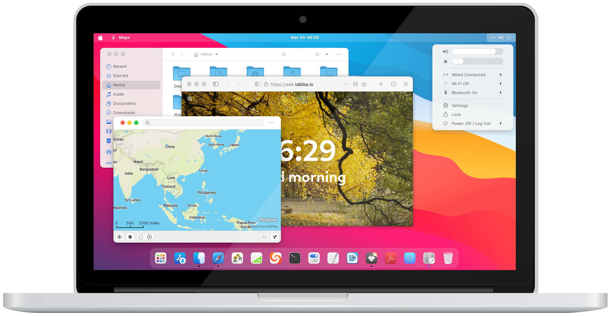

<h1 align="center"> WhiteSur GTK Theme </h1>

  

 This project is based on another https://github.com/vinceliuice/WhiteSur-gtk-theme 

# Installation is easy!

 
 Required dependencies info 

### Gtk2 theme required
- gtk-murrine-engine     `Fedora/RedHat`
- gtk2-engines-murrine   `Ubuntu/Mint/Debian`
- gtk-engine-murrine     `Arch/Manjaro`

### Install from source required
- sassc
- libglib2.0-dev-bin     `ubuntu 20.04`
- libglib2.0-dev         `ubuntu 18.04` `debian 10.03` `linux mint 19`
- libxml2-utils          `ubuntu 18.04` `debian 10.03` `linux mint 19`
- glib2-devel            `Fedora` `Redhat`

## Local installation

### Use the stable package
You can choose the compressed file [compiled in stable version](src) 
and unzip it to the theme folder `~/.themes` under the user folder.

## Global installation

### Use the stable package
You can choose the compressed file [compiled in stable version](src) 
and unzip it to the theme folder `/usr/share/themes` under the user folder.
